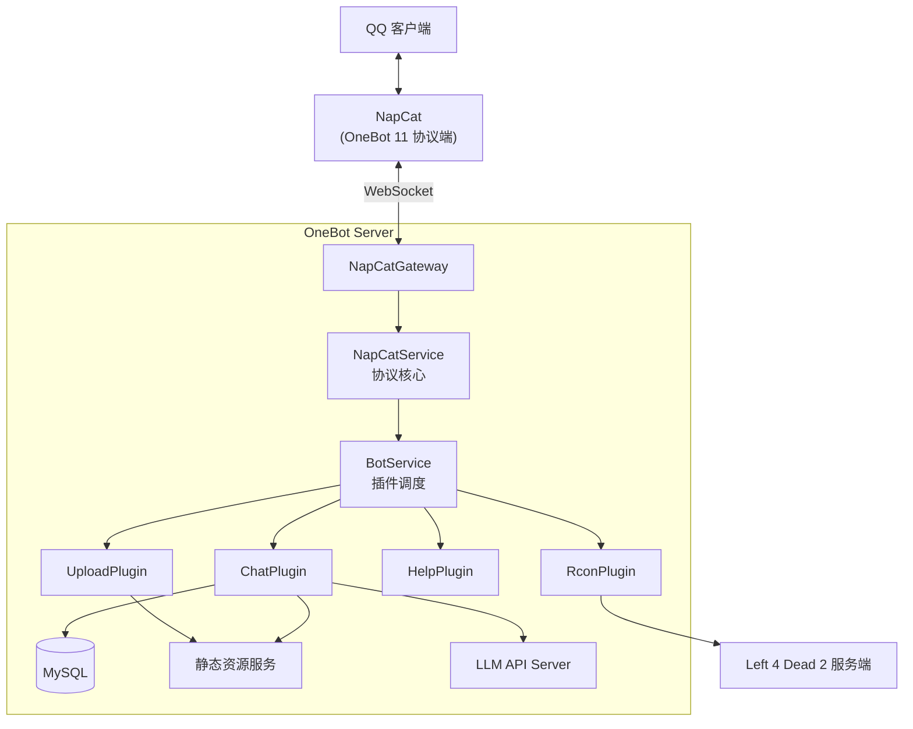

> 完整的介绍文档请参考：<https://blog.opensrv.cloud/application/qq-bot/>

# OneBot-Server

基于 NestJS + WebSocket 实现的 QQ 机器人服务端。

## 核心功能

1. 通过 `/upload` 指令上传群文件到服务器；
2. 通过 `/remote <指令>` 发送 RCON 命令到 `Left 4 Dead 2` 服务器，并回传执行结果；
3. 通过 `/help` 指令获取所有插件的使用说明；
4. 直接和大模型进行对话，支持输入文本、图片、视频、文件等内容。

## 系统结构



### 会话存储

使用 `MySQL` 存储 `uid` → `conversationId` 的映射与 `NapCatEvent` 事件内容，用于多轮会话和引用回复。

**配置文件**

```env
DB_HOST=localhost
DB_PORT=3306
DB_USER=root
DB_PASSWORD=******
DB_DATABASE=onebot_server
```

**BotConversation 会话表**

接口层 LLM API Server 使用 `conversationId` 存储会话上下文，在多轮会话场景中请求体需要携带 `prompt` 和 `conversationId`，因此应用层需要把 `uid` → `conversationId` 的映射存进这张表。

`uid` 的设计实现了两级隔离：

- 群聊 `g_{群号}_{QQ号}`：同一个 QQ 群内不同成员各自有独立的上下文，`A` 聊的内容不会串到 `B`；
- 私聊 `p_{QQ号}`：每个用户都有一条独立的上下文。

| 字段           | 类型   | 说明                                                         |
| -------------- | ------ | ------------------------------------------------------------ |
| uid            | string | 主键 - 会话隔离维度，群聊 `g_{群号}_{QQ号}`、私聊 `p_{QQ号}` |
| conversationId | string | 接口层返回的多轮会话 ID                                      |
| createdAt      | Date   | 会话创建时间，`TypeORM` 自动填充                             |

**NapCatMessage 消息表**

当用户使用 QQ 的 **引用回复** 功能回复某条消息时，NapCat 推送的事件中只有一个 `reply` 段携带被引用消息的 `message_id`，不带原文内容，因此应用层需要存储每一条消息的原始内容，通过反查这张表，递归还原出被引用消息的完整内容（包括文字、图片、视频等）。

| 字段      | 类型   | 说明                                   |
| --------- | ------ | -------------------------------------- |
| id        | number | 主键 - 直接使用 NapCat 的 `message_id` |
| data      | JSON   | 整条 `NapCatEvent` 事件的原始内容      |
| createdAt | Date   | 消息发送时间，`TypeORM` 自动填充       |


引用可能是 **递归** 的，因此必须存储完整的原始事件，才能正确还原引用链。


### 资源转存

应用层会启动一个允许公网访问的 **静态资源服务**，把根目录的 `public` 文件夹暴露到公网中。

**核心作用**

NapCat 推送的事件中，图片、音频、视频、文件 URL 是腾讯媒体服务器生成的临时链接，携带过期、`token` 校验、防盗链等，无法被 LLM 直接读取，应用层可以通过静态资源服务将其转存到服务器本地并生成新的公网链接，再拼接到 `prompt` 中即可被 LLM 解析。


Bot 服务 **不能直接暴露在公网中**，无法对外提供文件，因此需要在入口文件中单独启动静态资源服务，监听不同的端口。


**实现原理**

全局内置统一的下载方法 `download`，可以将 NapCat 推送的临时资源链接下载到根目录的 `public` 文件夹中，用 `UUID` 命名（避免同文件名覆盖），并返回公网链接。

```typescript
let prompt = '';
for (const segment of userMsg) {
  const { type, data } = segment;
  const { text, file, file_id, url, id } = data;

  switch (type) {
    case 'text':
      prompt += text;
      break;

    case 'image':
      prompt += `[图片名称：${file}，图片链接：${url}]`;
      break;

    case 'video': {
      if (!url) continue;
      // 视频可以立刻拿到下载链接 需要转存到服务器才能访问
      const publicUrl = await download(url);
      prompt += `[视频名称：${file}，视频链接：${publicUrl}]`;
      break;
    }

    case 'file': {
      if (!file_id) continue;
      let res: NapCatApiResponse;

      if (message_type === 'private') {
        res = await napCatService.getPrivateFileUrl(user_id!, file_id);
      } else {
        res = await napCatService.getGroupFileUrl(group_id!, file_id);
      }

      const url = res.data.url;
      if (!url) continue;

      const publicUrl = await download(url);
      prompt += `[文件名称：${file}，文件链接：${publicUrl}]`;
      break;
    }

    case 'reply': {
      const prevMessage = await this.messageManager.findMessage(id!);
      if (!prevMessage) continue;

      const replyPrompt = await this.handleSegments(prevMessage, napCatService);

      prompt += `[引用消息："${replyPrompt}"]`;
      break;
    }
  }
}
return prompt;
```


NapCat 推送的临时链接后缀名是不可靠的，需要通过二进制识别并追加新的文件名后缀，才能被正确解析。


### 内置插件

应用层收到 NapCat 消息后，会调用相应的插件处理，插件按优先级依次匹配：`UploadPlugin` → `RconPlugin` → `HelpPlugin` → `ChatPlugin`。其中 `ChatPlugin` 为兜底插件，无条件命中，放在最后。

1. `UploadPlugin`

用于上传群文件到服务器，指令为 `/upload`。

**配置文件**

```env
UPLOAD_SAVE_DIR=******
UPLOAD_FOLDER_NAME=******
UPLOAD_ALLOWED_GROUPS=ID1,ID2
```

**实现原理**

插件会向 NapCat 发送 `get_group_file_url` 消息，在群文件根目录查找 `UPLOAD_FOLDER_NAME` 指定的文件夹，遍历其中全部文件，发送 `get_group_file_url` 消息逐个获取下载链接并转存到 `UPLOAD_SAVE_DIR` 指定的目录中，插件还会实时推送文件上传进度（已存在的文件自动跳过）。

| 状态       | 说明     |
| ---------- | -------- |
| skipped    | 已经存在 |
| processing | 正在上传 |
| failed     | 上传失败 |
| done       | 上传成功 |

仅 `UPLOAD_ALLOWED_GROUPS` 白名单内的群聊可用。

2. `RconPlugin`

用于发送 RCON 命令到 `Left 4 Dead 2` 服务器，并回传执行结果，指令为 `/remote <指令>`。

**配置文件**

```env
RCON_HOST=localhost
RCON_PORT=27015
RCON_PASSWORD=******
RCON_ALLOWED_USERS=ID1,ID2
```

**实现原理**

基于 **起源引擎** 的游戏服务端启动之后，会额外开启一个 `TCP` 监听，用于接收远程发来的控制台命令，控制游戏服务端的运行。

`RconPlugin` 会监听以 `/remote` 开头的 QQ 消息，通过 RCON 协议连接 `Left 4 Dead 2` 服务端，将消息中携带的命令转发给游戏服务器，拿到执行结果后回传给 QQ。

插件内部维护单例 RCON 长连接与异步锁，避免并发重复连接。


**RCON**（Remote Console）是 Valve 定义的 `TCP` 协议，用于向游戏服务器下发控制台命令，并将执行结果回传。**起源引擎** 实现了这套协议，`Left 4 Dead 2`、`Counter-Strike: Source` 等游戏都原生支持。


仅 `RCON_ALLOWED_USERS` 白名单内的用户可用。

3. `HelpPlugin`

用于获取所有插件的使用说明，指令为 `/help`。

4. `ChatPlugin`

用于和大模型对话，不需要指令前缀。

**实现原理**

`ChatPlugin` 会监听所有消息，并调用接口层的大模型服务进行对话。插件会响应所有私聊消息，但群聊仅响应 `@机器人` 的消息。

你可以发送文本、图片、视频、文件等内容，也可以引用或回复一条历史消息，插件内部会将消息段解析后拼接成完整的 `prompt`。会话上下文按照群聊 `g_{群号}_{QQ号}`、私聊 `p_{QQ号}` 的 `uid` 规则进行隔离。

### 协议核心

`NapCatService` 是应用层的协议核心，它从 `WebSocket` 客户端接收 NapCat 事件，并按类型分发到插件模块中。

**通信方法**

`NapCatService` 定义了全局唯一一个和 NapCat 客户端直接通信的私有方法 `sendApiRequest`，并基于此封装了六个对其他模块公开的通信 API。

| 方法                  | 说明                 |
| --------------------- | -------------------- |
| sendPrivateMessage    | 发送私聊消息         |
| sendGroupMessage      | 发送群聊消息         |
| getPrivateFileUrl     | 获取私聊文件真实URL  |
| getGroupFileUrl       | 获取群聊文件真实URL  |
| getGroupRootFiles     | 获取群根目录文件列表 |
| getGroupFilesByFolder | 获取群文件夹文件列表 |


`sendApiRequest` 可以调用任意的 NapCat `action`，但它不应该直接对外暴露，而是将协议实现细节封装在模块内部，只对外暴露语义化的业务接口。


所有通信 API 的返回值统一是 `Promise<NapCatApiResponse>`，业务层可以通过 `await` 拿到 `data` 字段。

**消息匹配**

`WebSocket` 是全双工通信协议，请求和响应不能保证按顺序到达，因此会产生 **消息收发的时序性问题**。OneBot 11 WebSocket 通信约定：请求携带 `echo` 字段时，响应会原样回传这个 `echo`，发送方可以据此匹配。

发送消息时生成一个随机的 `echo` 字符存入 `requestMap`：key = `echo`，value 存这个 Promise 的 `{resolve, reject}`，设置 `5000ms` 的超时定时器。当收到 NapCat 推送回来的消息时，根据 `echo` 从 `requestMap` 中取出存好的 `{resolve, reject}` 并执行对应操作。

- 成功：清除超时计时器，`resolve` 返回响应；
- 失败：清除超时计时器，`reject` 抛出错误。

```typescript
private sendApiRequest(
  request: Omit<NapCatApiRequest, 'echo'>,
): Promise<NapCatApiResponse> {
  return new Promise((resolve, reject) => {
    if (
      !this.activeClient ||
      this.activeClient.readyState !== WebSocket.OPEN
    ) {
      reject(new Error('客户端未连接'));
      return;
    }

    const echo = randomUUID();
    const fullRequest: NapCatApiRequest = { ...request, echo };

    const timeout = setTimeout(() => {
      this.requestMap.delete(echo);
      reject(new Error(`${request.action} - 请求超时`));
    }, 5000);

    this.requestMap.set(echo, {
      resolve: (res: NapCatApiResponse) => {
        clearTimeout(timeout);
        resolve(res);
      },
      reject: (err: Error) => {
        clearTimeout(timeout);
        reject(err);
      },
    });

    const data = JSON.stringify(fullRequest);
    this.activeClient.send(data);
  });
}
```
